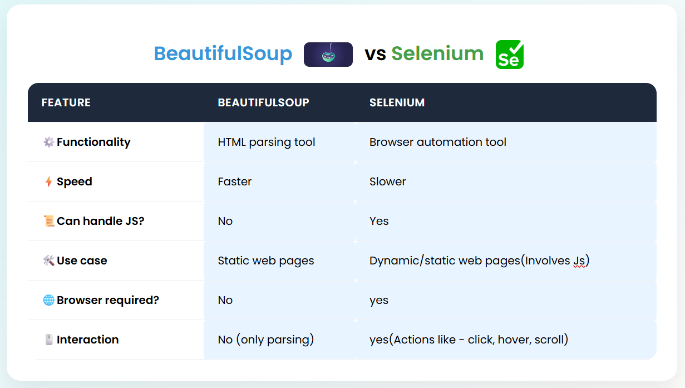

# 🆚 BeautifulSoup vs Selenium – Web Scraping Comparison

This repository contains a practical comparison between **BeautifulSoup** and **Selenium**, two powerful Python libraries used for web scraping.

## 📌 What’s Inside?

- ✅ Use-case based comparison table
- 🧠 Explanation of static vs dynamic webpages
- 💻 Hands-on code examples
- 📸 Visual comparison screenshot
- ⚙️ Setup instructions

---

## 🔍 Tools Compared



| Feature               | BeautifulSoup       | Selenium                       |
|-----------------------|---------------------|--------------------------------|
| Type                  | HTML parser         | Browser automation tool        |
| Speed                 | Fast                | Slower (runs full browser)     |
| Can handle JS?        | ❌ No               | ✅ Yes                          |
| Use case              | Static pages        | Dynamic/JS-heavy pages         |
| Browser required?     | ❌ No               | ✅ Yes                          |
| Interaction possible? | ❌ No               | ✅ Yes (clicks, forms, etc.)   |

---

## ⚡ Static vs Dynamic Webpages

- **Static**: HTML is available in the source directly (e.g., basic blog posts)
- **Dynamic**: Content loads via JavaScript (e.g., modern apps, infinite scroll)

> 📸 _See the screenshot `static_vs_dynamic.png` for clarity._

---

## 💡 Sample Code

### 🔹 BeautifulSoup (static)

```python
import requests
from bs4 import BeautifulSoup

url = "https://quotes.toscrape.com/"
response = requests.get(url)
soup = BeautifulSoup(response.text, 'html.parser')

for quote in soup.find_all("span", class_="text"):
    print(quote.text)
